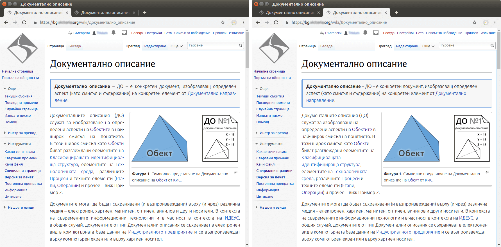

# mw-Typography

MediaWiki Extension that uses the repository [php-typography](https://github.com/mundschenk-at/php-typography) and process the wiki text through it in order to insert hyphens inside.

***This is an Alpha version**, that currently meets my desires and I decided to share it with you guys. Note I'm not developer. I'm just enthusiast that can use Google search and Stack Exchange services. This is my first attempt with MediaWiki extensions. So this extension could be done in more professional way. I'm still learning.*

## Features

* **Hyphenation of the wiki text.** The repository [php-typography](https://github.com/mundschenk-at/php-typography) has more features (than this), but currently most of them are disabled via the configuration. My further intention is to make them available through configuration variables. If you wish you can tweak your own copy of the extension through changing the values of the configuration object `$mwTypographySettings`.

* **Wiki family support**. The repository [php-typography](https://github.com/mundschenk-at/php-typography) supports over [70 languages](vendor/mundschenk-at/php-typography/src/lang). So the extension has a language code "translation" condition, that uses `$wgLanguageCode` in order to determinate the language of your wiki automatically. Currently for the wikis that use `$wgLanguageCode = 'en'` the hyphenation language is set as `$mwHyphenationLanguage = 'en-US'`. You can tweak this behavior by editing of [`mw-Typography.php`](mw-Typography.php).

  Note this feature is not a real multi language support, that will allow you to hyphenate wiki text with  multi language content. An example of such implementation cold be found at the WordPress plugin [wp-Typography](https://wordpress.org/plugins/wp-typography/).

* **Justify the text.** The extension will add a small portion of [CSS code](css/mw-Typography.css) in order to justify your wiki content. If you do not wish that, just remove the relevant line in [`mw-Typography.php`](mw-Typography.php). **It is better (faster) to place CCS such this in your `MediaWiki:Common.css`.**

* **Clear clipboard.** The extension uses an additional JavaScript in order to remove the `&shy;` signs from the text when you copy it. This JavaScript is borrowed from [wp-Typography](https://wordpress.org/plugins/wp-typography/).

* **Name spaces limitation.** There is an array - `$mwTypographyAllowedNameSpaces` - that contains the number values of the name spaces on which the extension should operate. I've involved this limitation because processing of some MediaWiki `Special:` pages is too slow. Currently you can extend this array through editing [`mw-Typography.php`](mw-Typography.php).

## Installation

Clone (download) the extension's repository in your MediaWiki `$IP/extensions` directory:

````bash
cd $IP/extensions
# Use HTTPS:
git clone https://github.com/pa4080/mw-Typography.git
````

For developers (which have enough rights and [ssh access](https://askubuntu.com/a/1097078/566421)):

````bash
# Use SSH:
git clone git@github.com:pa4080/mw-Typography.git
````

The current repository redistributes [php-typography](https://github.com/mundschenk-at/php-typography), if you want to [update](https://github.com/mundschenk-at/php-typography#installation) it, you can use Composer in this way:

````bash
cd $IP/extensions/mw-Typography
sudo composer update            # sudo chown -R www-data:www-data ./ && sudo -u www-data composer update
php vendor/bin/update-iana.php  # sudo -u www-data php vendor/bin/update-iana.php
````

Finally enable the extension in `LocalSettings.php` of your MediaWiki instance:

````php
require_once "$IP/extensions/mw-Typography/mw-Typography.php";
````

Navigate to `Special:Version` to check whether `mw-Typography` extension is enabled. It should work now.

## Requirements

Requirements transcluded from [Code by Der Mundschenk & Cie. /wp-Typography](https://code.mundschenk.at/wp-typography/):

* The host server must run `PHP 5.6.0` **or later**,
* The installation of PHP must include the [`mbstring`](https://www.php.net/manual/en/mbstring.installation.php) extension,
* The text must be `UTF‐8` encoded.

MediaWiki version compatibility:

* The extension is tested only with **MediaWiki 1.32**. The hooks - [ParserAfterTidy](https://www.mediawiki.org/wiki/Manual:Hooks/ParserAfterTidy) and [BeforePageDisplay](BeforePageDisplay) - used in the extension are available from version 1.5 and 1.7. According to that **MediaWiki 1.7** should be the oldest version that could use this extension.

* ~~In the file [`mw-Typography.php`](mw-Typography.php) is made a limitation to **MediaWiki 1.32** and above. Probably the extension should work on older versions, but I've not tested this.~~

## Screen shots and tests

The extension is tested on a MediaWiki Family that supports Bulgarian, Russian and English languages and it works nice - as it is expected. In my opinion, of doctor of engineering science, this is must have feature for each CMS!



## Acknowledgement

Special thanks to [Peter Putzer](https://code.mundschenk.at/), the author of [wp-Typography](https://wordpress.org/plugins/wp-typography/), who [pointed me](https://wordpress.org/support/topic/excellent-great-and-essential-plugin/) in the right direction.

## Work in progress notes

* https://www.mediawiki.org/wiki/Manual:Hooks
* Currently used hooks can't process the StructuredDiscussions (Flow) pages - [reference](https://www.mediawiki.org/wiki/Topic:V2lkq91o5myfo6r0)
